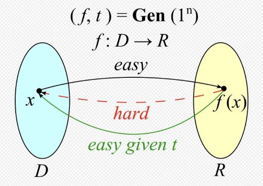

# Elliptical Curve Cryptography (ECC)
{: .no_toc }

## Table of contents
{: .no_toc .text-delta }

1. TOC
{:toc}

---

## Definition

Elliptical Curve Cryptography (ECC) is a type of the trapdoor function. In theoretical computer science and cryptography, the trapdoor function is a function that is easy to compute in one direction, yet difficult to compute in the opposite direction (finding its inverse) without special information, called the "Trapdoor". In Publick Key Infrastructure (PKI) using ECC, the "Trapdoor" shall be the 'public key'. For example, In <b>Pic.1</b>, the given <b>'t'</b> shall be the public key. Thus, the main purpose of the usage of ECC is to create the public key by feeding a private key which is generated randomly (e.g., 32 bytes positive integer) into ECC function.

    
     <b>[Pic.1]Trapdoor</b>

## Reference
Please refer to the listed reference below. That help you understand what is ECC.
- [ECC Overview]
- [ECC Mathmetical Explanation]
- [Trapdoor Wikipedia definition]
- [ECC Research paper]

## Deep Dive
1. <b>Elliptical Curve Cryptography</b>
    * The elliptical curve of ECC is based on the mathmetical function in the finite field, which contains a finite number of elements. Thus, the result of the operations of multiplication, addition, subtraction and division meet the rules of arithmetic known as the field axioms. The most common examples of finite fields are given by the integers mod p, which is a prime/binary number.

---
[ECC Overview]:https://www.youtube.com/watch?v=dCvB-mhkT0w
[ECC Mathmetical Explanation]:https://andrea.corbellini.name/2015/05/17/elliptic-curve-cryptography-a-gentle-introduction/
[Trapdoor Wikipedia definition]:https://en.wikipedia.org/wiki/Trapdoor_function
[ECC Research paper]:https://www.secg.org/sec1-v2.pdf